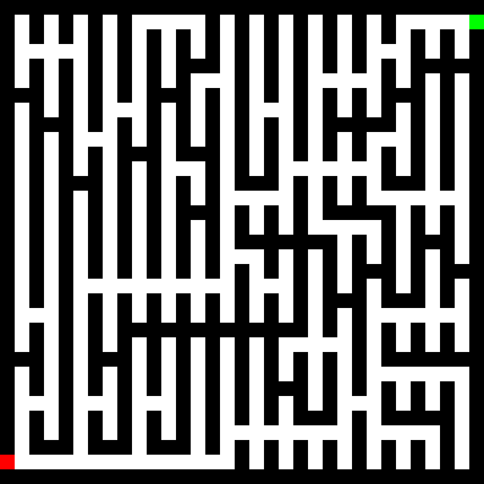
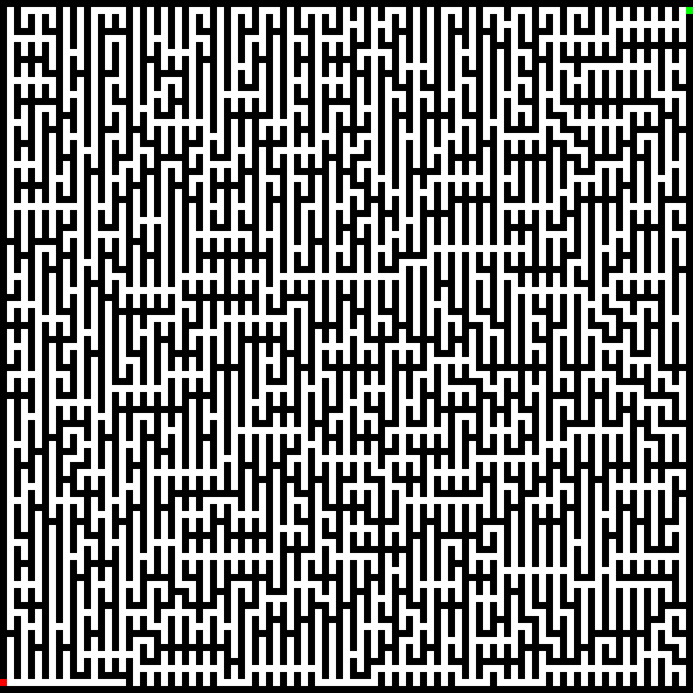
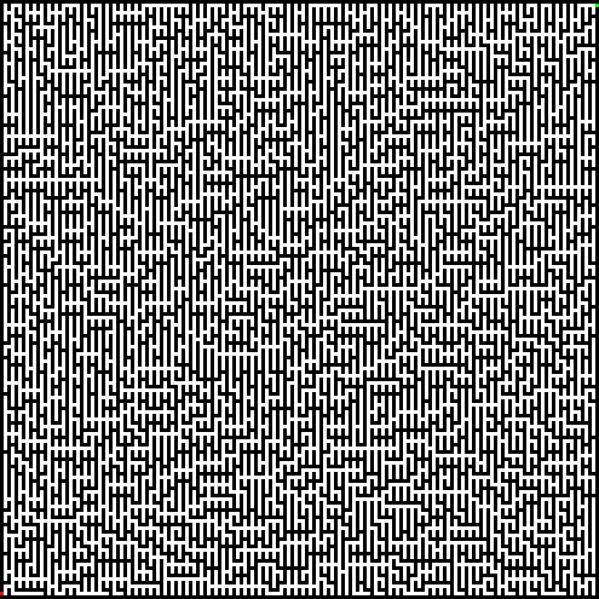

# a-MAZE-ing game

## Backstory
<p align="justify">This was one of my favorite coding projects to work on. The backstory to this is that, during the first programming class in university, we had to use plain old C to work on an application idea that we chose for ourselves. I didn't really know what I should make, but I thought making an algorithm that generates a labyrinth could be a lot of fun. At that point, I didn't really know that there are hundreds of different ways to generate labyrinths and that coding in C is nothing compared to C#. I had to realize that good readability and documentation were traded for speed. I had a lot of trouble with using pointers, creating strings, and getting "Segmentation fault (core dumped)" messages, but it was a fun learning process. So, this is how this project came to life.</p>

## Maze generation
<p align="justify">For the maze generation process, I chose a method called Prim's modified algorithm. Basically, how this works is that we start off with an (n * n) large matrix, where each element is a cell of the maze. At the start, each of them is considered a wall, so it's not really a maze. First, we mark the bottom left corner as the starting point. Then, we create a container for tracking neighboring cells. We add all the unvisited and available neighbors of the chosen cell to that container. This can range from 2-4, depending on the cell's position in the maze. Now, we select one of these neighbors randomly and connect it with the originally selected cell. We mark the original as finished and the new one as used. We continue this same process until no neighboring cells are available in the container. Finally, we add an entrance and exit point on the two diagonally opposite side. I left a small clip that shows the generation process visually. If you are interested in maze generation, you can read more on their <a href="https://en.wikipedia.org/wiki/Maze_generation_algorithm">Wikipedia</a> page.</p>
</br>


## The game
<p align="justify">The game itself is not that complicated. The player controls the red square located at the bottom left corner and the aim of the game is to reach the green square on the opposite side. You can either you WASD or the arrow keys. When you are in-game, you can use the ESC key to open the menu and select a few options. The game let's you choose from 3 different difficulty levels.</p>

### Easy


### Medium


### Hard


## Results
<p align="justify">After you finish a run, you should see a new file in your game folder called: "results.txt". You can find entries about all the completed runs in it. It states when you played, what was the difficulty level and the time it took for you to complete it similarly to this provided example.</p>

```
[2023.06.07 15:34] [ EASY ] [00:19]
[2023.06.07 15:43] [ EASY ] [00:41]
[2023.06.07 15:53] [ EASY ] [00:20]
[2023.06.07 16:04] [MEDIUM] [03:11]
[2023.06.07 19:13] [ HARD ] [07:52]
```
